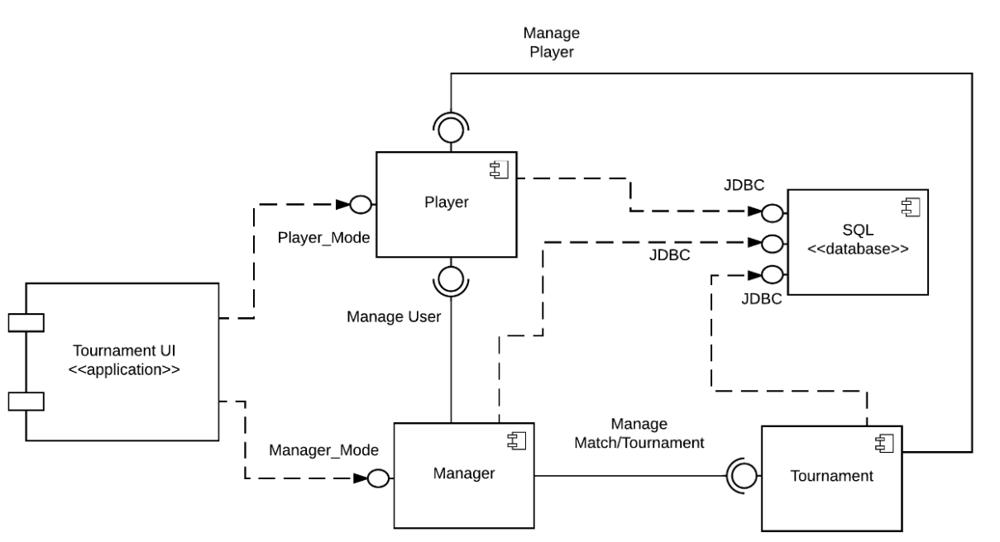

# Design Document

*This is the template for your design document. The parts in italics are concise explanations of what should go in the corresponding sections and should not appear in the final document.*

**Author**: 6300Spring17Team07

## 1 Design Considerations

### 1.1 Assumptions

There are no additional assumptions about the requirements or desired functionality of the TourneyCalc application.  We assume all requirements are outlined in the Assignment 5 description.

### 1.2 Constraints

There are no additional constraints on the system besides those outlined in the system environment below.  The TourneyCalc application is being designed to be as flexible as possible as far as platforms it can be deployed on and the required peripherals to interact with the application.  There are no external dependencies besides those listed in the Android Compatibiilty Definition Document.  In fact, the application can run without some of the standard peripherals on most Android devices, for example, no network connectivity or geolocation is required.

### 1.3 System Environment

#### Hardware

This application requires hardware compliant with the Android Compatibility Definition Document for Android 4.4.  The reference for this application is Revision 1 dated November 27, 2013.  A link to the document is available at the end of this section.  This document requires navigation user inputs such as Home, Recent, and Back buttons as well as hardware input compatible with screen navigation, entry selection, and keyboard input.  Additionally, a screen with sufficient resolution to render complex applications is required.  A link to the Android documentation is here: https://static.googleusercontent.com/media/source.android.com/en//compatibility/4.4/android-4.4-cdd.pdf

#### Software

Android Operating system version 4.4 "Kitkat" or newer is required.

## 2 Architectural Design

### 2.1 Component Diagram

The component diagrams includes several components. Tournament UI is mainly the application UI, which can choose different modes(player mode and manager mode). Manager interactively works with Player and Tournament to manage the user and tournament separately; and connect with database to retrieve the tournament/player information. Tournament retrieve players info from Player and build up the matchlist. Player and Tournament all need to work with database to store/extract persistent information of matchlist, tournament data and player data.

### 2.2 Deployment Diagram

## 3 Low-Level Design

Tournament class and Match class implement the functionality for Tournament component. Tournament class interacts with Match class via schedule/start/end match operations to manage the matches inside Tournament component. ManagementSystem class and TournamentResult class implement the functionality for Manager component. ManagementSystem class works with User class to implement the function of Manage User. ManagementSystem achieve the manage tournament goal through the interconnection with Tournament class. PlayerSystem and User class implement the functionality for Player component. And Tournament&Match class interactively work with User class to achieve the function of Manage Player.

### 3.1 Class Diagram

### 3.2 Other Diagrams

No othe diagrams are required to capture the design of this application.

## 4 User Interface Design

  
This is the main screen of the application that is displayed when the application is started.
From here the user can select manager mode or player mode

### Player Mode
If the user selects Player Mode, they will be shown one of two screens depending on if there
is an active tournament.

  
This is the menu that will be displayed to the user if there is no active tournament.
It will allow the user to view a list of all players.

  
This is the menu that will be displayed to the user if there is an active tournament.
It will allow the player to view the match list.

  
If there is no ongoing tournament, the user will be able to see a list of players
and their total prizes.

  
If there is an ongoing tournament, the user will be able to see a list of ongoing
and completed matches.

### Manager Mode

Similarly to the Player Mode, the Manager Mode will have two different available screens
depending on if there is a tournament in progress.

  
If there is no ongoing tournament, the manager will be able to manage users, create
tournaments, and view house profits

  
If there is an active tournament, the manager will be presented with the option to view the
match list and manage the tournament.

  
If there is an ongoing tournament, the manager will be able to see a list of ongoing
and completed matches. From here the manager will be able to start matches as well as end
matches and record the result.

  
As with the user, the manager will be able to view a list of players and their lifetime
winnings. However if the manager selects one of the users, they will be taken to the player
detail view.

  
Here the manager can view details about a player, see their historical match history and
winnings, as well as delete a player if necessary.

  
From the user screen, a manager can also add enter player details and add them to the system.

  
From the user screen, if there is not an active tournament the manager will be able to enter
details about the tournament as well as add users. Upon clicking the Create Tournament
button, they will be directed to a confirmation screen. The tournament will not be created
at this point.

  
Here the manager will be shown prizes for the winners of the tournament as well as the expected
house cut of the profits. The tournament will be created and started after the manager
presses the Create Tournament button.

  
From this screen the manager will be able to see a list of tournaments and the profit that
the house made from each.
