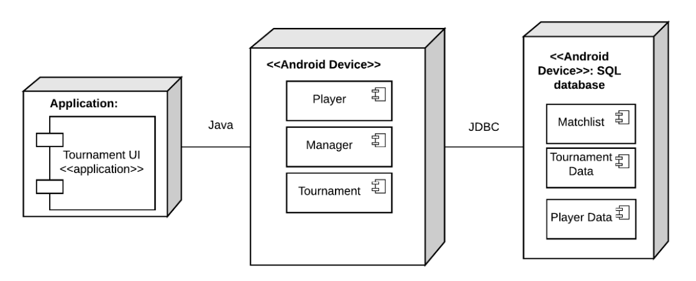

# Design Document

*This is the template for your design document. The parts in italics are concise explanations of what should go in the corresponding sections and should not appear in the final document.*

**Author**: \<person or team name\>

## 1 Design Considerations

*The subsections below describe the issues that need to be addressed or resolved prior to or while completing the design, as well as issues that may influence the design process.*

### 1.1 Assumptions

*Describe any assumption, background, or dependencies of the software, its use, the operational environment, or significant project issues.*

### 1.2 Constraints

*Describe any constraints on the system that have a significant impact on the design of the system.*

### 1.3 System Environment

#### Hardware

This application requires hardware compliant with the Android Compatibility Definition Document for Android 4.4.  The reference for this application is Revision 1 dated November 27, 2013.  A link to the document is available at the end of this section.  This document requires navigation user inputs such as Home, Recent, and Back buttons as well as hardware input compatible with screen navigation, entry selection, and keyboard input.  Additionally, a screen with sufficient resolution to render complex applications is required.  A link to the Android documentation is here: https://static.googleusercontent.com/media/source.android.com/en//compatibility/4.4/android-4.4-cdd.pdf

#### Software

Android Operating system version 4.4 "Kitkat" or newer is required.

## 2 Architectural Design

*The architecture provides the high-level design view of a system and provides a basis for more detailed design work. These subsections describe the top-level components of the system you are building and their relationships.*

### 2.1 Component Diagram

*This section should provide and describe a diagram that shows the various components and how they are connected. This diagram shows the logical/functional components of the system, where each component represents a cluster of related functionality. In the case of simple systems, where there is a single component, this diagram may be unnecessary; in these cases, simply state so and concisely state why.*

**The component diagrams includes several components. Tournament UI is mainly the application UI, which can choose different modes(player mode and manager mode). Manager interactively works with Player and Tournament to manage the user and tournament separately; and connect with database to retrieve the tournament/player information. Tournament retrieve players info from Player and build up the matchlist. Player and Tournament all need to work with database to store/extract persistent information of matchlist, tournament data and player data.**

### 2.2 Deployment Diagram

*This section should describe how the different components will be deployed on actual hardware devices. Similar to the previous subsection, this diagram may be unnecessary for simple systems; in these cases, simply state so and concisely state why.*

## 3 Low-Level Design

*Describe the low-level design for each of the system components identified in the previous section. For each component, you should provide details in the following UML diagrams to show its internal structure.*

*Tournament class and Match class implement the functionality for Tournament component. Tournament class interacts with Match class via schedule/start/end match operations to manage the matches inside Tournament component. ManagementSystem class and TournamentResult class implement the functionality for Manager component. ManagementSystem class works with User class to implement the function of Manage User. ManagementSystem achieve the manage tournament goal through the interconnection with Tournament class. PlayerSystem and User class implement the functionality for Player component. And Tournament&Match class interactively work with User class to achieve the function of Manage Player.*

### 3.1 Class Diagram

### 3.2 Other Diagrams

No othe diagrams are required to capture the design of this application

## 4 User Interface Design
*For GUI-based systems, this section should provide the specific format/layout of the user interface of the system (e.g., in the form of graphical mockups).*

